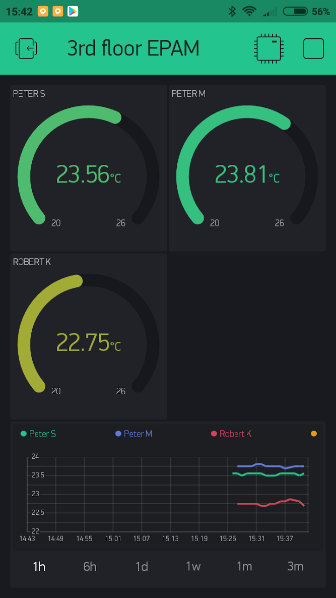

# temp-monitor
Wifi based temperature monitor based on ESP8266 NodeMCU V3 and high accuracy MCP9808 I2C sensor module.

## Features

* The MCP9808 has been selected as the chip accuracy is around 0.25 ℃ in room temp rang. This is much better compared to the other more popular (but also cheaper) sensors (DHT11, DHT22, DS1820B) as they usually have 1 ℃ accuracy without calibration according to their datasheets.
* Uses WIFI manager (https://github.com/tzapu/WiFiManager) to set the configuratio parameters
* The configuration portal can be triggered by pushing the tactile switch while the device is booting up
* The configuration json is saved to the internal SPIFFS, so it's preserved while the device is switched off
* The device goes into deep sleep for 60 seconds after it has finished the read cycle, the dip switch is required here because the reset pin must not be connected to the to the D?? pin while the sketches are uploaded from Arduino IDE 
* Integrated with the company captive portal (once it is connected to the WIFI using the PSK then it also need to be authenticated with and LDAP user/password pair on the captive portal)
* The measured sensor values are sent to blynk using the configured blynk key
* The measured sensor values are sent to the configured MQTT topic ( *topicname* and *topicname/esp chip ip* )
* A software based watchdog has been implemented which resets the ESP if it is running for more than 30 seconds (a usual cycle takes 5-7 seconds)

## Future improvement ideas 
* Implement DNS tunneling to send sensor data embedded in DNS requests instead of MQTT so an open quest wifi can be used wihtout any kind of authentication  
* HTTP Based remote update which is triggerd by an MQTT
* Theare are 1-2 faulty sensor reads per day (above 100C or -0.06C, etc...) this should be filtered out and the measuring should be repeated.

# Bill of Materials

Item | Price | Image | Url
-----|-------|-------------|----
ESP8266 NodeMCU V3| US $2.61 || https://goo.gl/DwVFW4
MCP 9808 I2C High accuracy sensor | US $3.33 |  | https://goo.gl/uG1uYr
5 X 7 cm PCB Board | US $0.33 |  | https://goo.gl/f7Y47i
DIP Switch 1P | US $1.20 (10pcs)|  | https://goo.gl/7sHMXX
Push Button | US $1.45 (20pcs)|  | https://goo.gl/8Kr8Ng
Dupont wires | US $0.31 |  | https://goo.gl/uZkXnA 
10 KOhm resistor | US $0.95 |  | https://goo.gl/5iU3pM
Power supply | US $2.36 |  | https://goo.gl/fMZzbB
**In total** | **US $12.21** |

# Blynk based mobile app

# Live (serverless) heatmap 
https://rawgit.com/reluxa/temp-monitor/master/site/index.html
